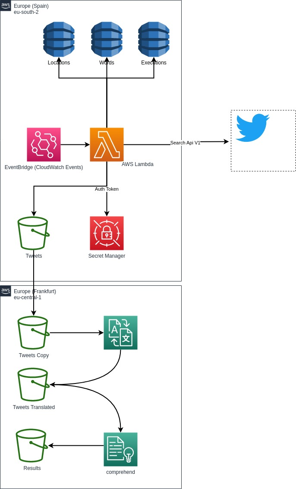

# Hackathon For Good: La Región de AWS en España al Servicio de la Sociedad

## Descripción del Proyecto

Una breve descripción de:
¿Qué problema estamos tratando de resolver?

Hemos intentado resolver el problema de **Acciona**.

¿Cuál es la solución propuesta?

Tomando como fuente de infromación Twitter hemos intentado obtener los tweets referente a un conjuto de terminos o palabras referentes a una localización física. Una vez obenidos los tweets referentes a una localización, mediante AWS Comprehend obtenemos los sentimientos de los tweets. De esta forma podremos tener medidas estadisticas de sentimientos por localización, concepto. Por ejemplo sentimiento de "suciedad" en "Madrid"

Descripción de la Solución

Dado la gran candidad de información que se puede obtener de Twitter, además de la inmediated que representa, hemos decidido utilizarlo como fuente de datos.

Primero de todo reseñar que la nueva versión del Api V2 de Twitter es necesario pagar por el uso, con lo que hemos decidido utilizar la V1 y solamente la operación que sigue disponible de forma gratuita: [https://developer.twitter.com/en/docs/twitter-api/v1/tweets/search/api-reference/get-search-tweets](https://developer.twitter.com/en/docs/twitter-api/v1/tweets/search/api-reference/get-search-tweetshttps:/)

La solución se compone de

* Tres tablas DynamoDB: Locations, Words y Executions.
  * En la tabla locations almacenamos la latitud longitud y el radio de busqueda de la consulta.
  * En la tabla Words lamacenamos el termino o terminos de la busqueda. Por ejemplo "suciedad", "suministro electrico"
  * En la tabla Executions vamos guardando el timestamp de la una busqueda para un termino. De esta forma en la siguiente ejecución únicamente obentemos los tweets desde la última ejecución.
* Secret Manager: Tenemos un secreto con la authenticación de la api de Tweeter.
* S3: Vamos guardando los tweets en texto  plano para ser procesados posteriormente por Comprehend.
* Lamda: Tendremos una lambda escrita en Phython en la que tendremos la lógica de la aplicación. Hemos intentado usar arn64 pero al desplegar este es el error que recibimos "Architecture "arm64" is not supported in eu-south-2. Please select "x86_64". Basicamente la lambda hace estos pasos:
  * Lee mediante la librería powetools para phyton el secreto de la autenticación del Api de Tweeter. Hemos ampliado el tiempo de cache del valor del secreto a 30s.
  * Se hace un scan de la tabla Locations y la tabla Words. Con cada uno de los pares Location / Word se consulta en la tabla ejecución el ultimo timestamp de la ejecución.
  * Se conecta al api de Tweeter con los pares de datos anteriores
  * Se almacena el resultado en S3
* AWS Comprehend: Debido a que no está disponible en la region Europe eu-south-2 Spain, en esta primera versión hemos decidido ejecutarla de forma manual de forma batch. Este es un ejemplo de los tweets procesados por Comprehend [assets/output.txt](assets/output.txt)
* Despliegue mediante CDK: Para desplegar la infrastructura hemos utilizado CDK (en Typescript). El proyecto cdk está en la carpeta [infra/](infra)

## Diagrama de Arquitectura

## Descripción Técnica

Una visión general de:

**¿Qué tipo de arquitectura habéis planteado?** Por lo general, las arquitecturas modernas de aplicaciones suelen utilizar microservicios y APIs para conectar los servicios, eso no quiere decir que nos podemos encontrar con arquitecturas de N-capas, arquitecturas monolíticas, de microservicios o basadas en eventos. Dependerá de vuestro caso de uso, pero nos gustaría conocer cuál ha sido vuestra elección.

**¿Qué tecnologías AWS se han utilizado?**

## Demo Vídeo

* [Video Demo](assets/HackathonSpain-20230509_175828-MeetingRecording.mp4)

## Team Members

Lista de los miembros del equipo e ID de correo electrónico.
